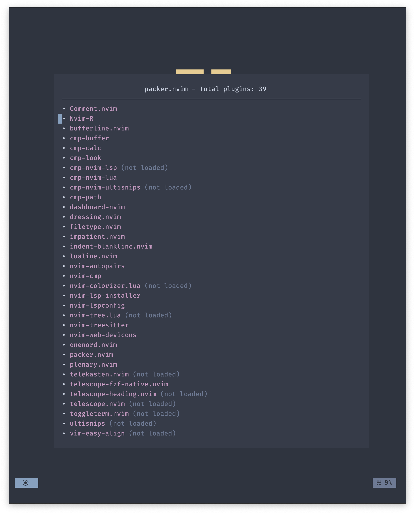

<h1 align="center"> &#9961 nvim &#9961 </h1>

A nvim configuration template with nord colorscheme, written in lua

Click to See More Showcases

    
    
    

# Key Features

- Contrasting while still Nordic colorscheme!
    - Supported with customized colorscheme inspired by [onenord.nvim](https://github.com/rmehri01/onenord.nvim).
    - Plus an additional REALLY good colorscheme: [nightfox.nvim](https://github.com/EdenEast/nightfox.nvim).
- Lazy loading (Under 100 msec startup time).
- Syntax highlighting with [nvim-treesitter](https://github.com/nvim-treesitter/nvim-treesitter).
- Keymap reminder with [which-key.nvim](https://github.com/folke/which-key.nvim).
- Pretty icons with [nvim-web-devicons](https://github.com/kyazdani42/nvim-web-devicons).
- Easy looking indentlines with [indent-blankline.nvim](https://github.com/lukas-reineke/indent-blankline.nvim).
- Startup screen with [dashboard-nvim](https://github.com/glepnir/dashboard-nvim).
- File tree with [nvim-tree.lua](https://github.com/kyazdani42/nvim-tree.lua).
- File finder, previewing files with [telescope.nvim](https://github.com/nvim-telescope/telescope.nvim).
- A tree like view for symbols with [symbols-outline.nvim](https://github.com/simrat39/symbols-outline.nvim).
- Functional and good looking statusline with [galaxyline.nvim](https://github.com/glepnir/galaxyline.nvim).
- Tabs and buffers manager with [bufferline.nvim](https://github.com/akinsho/bufferline.nvim).
- Auto pairing braces and tags with [nvim-autopairs](https://github.com/windwp/nvim-autopairs).
- Easy commentor with [Comment.nvim](https://github.com/numToStr/Comment.nvim).
- Improved UI experience with [dressing.nvim](https://github.com/stevearc/dressing.nvim).
- Pre-configed lsp for with [nvim-lspconfig](https://github.com/neovim/nvim-lspconfig) and [nvim-lsp-installer](https://github.com/williamboman/nvim-lsp-installer).
- Autocompletion with [nvim-cmp](https://github.com/hrsh7th/nvim-cmp).
- Snippets with [ultisnips](https://github.com/SirVer/ultisnips).

## Details

For video demo of the setup, view this:

For more details regarding the configuration and setup, view the wiki page.

# TODO

- Change to snippets to [LuaSnip](https://github.com/L3MON4D3/LuaSnip)
