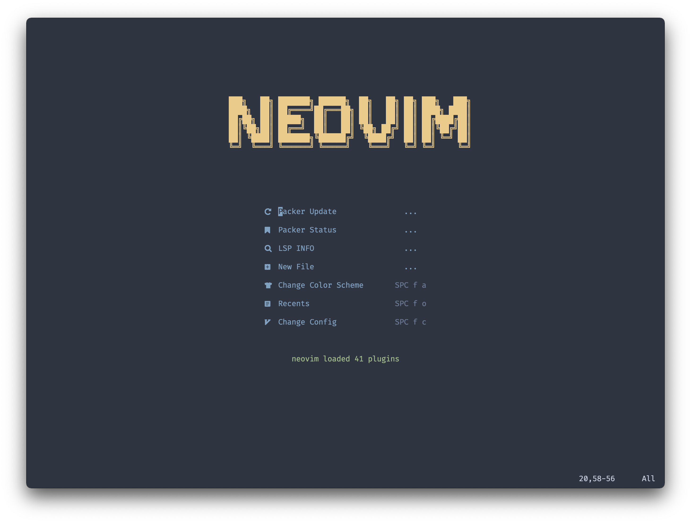
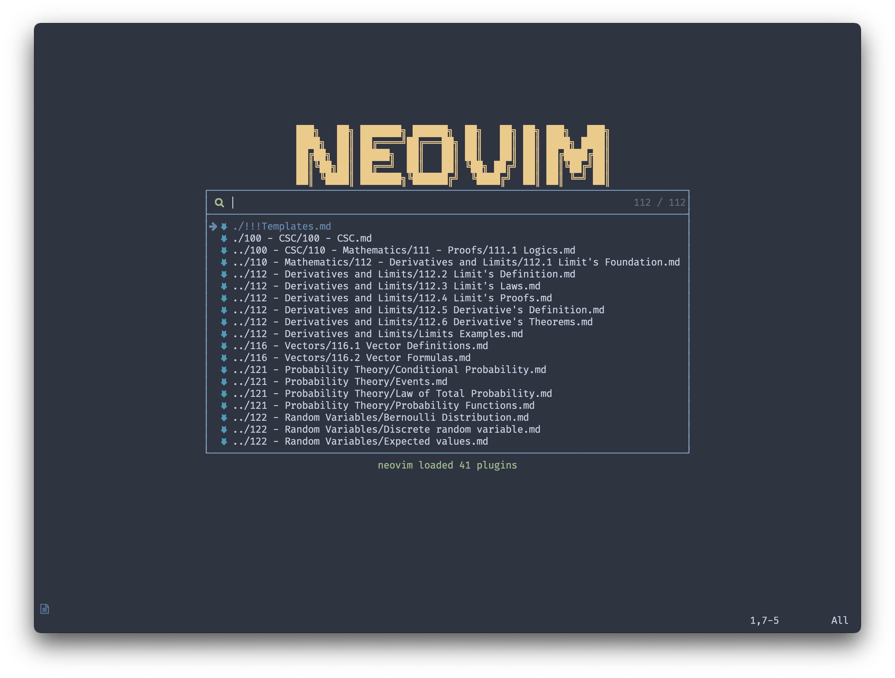
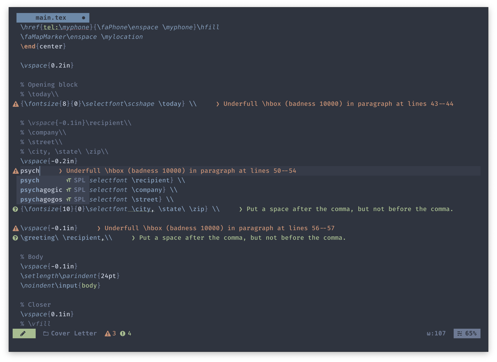
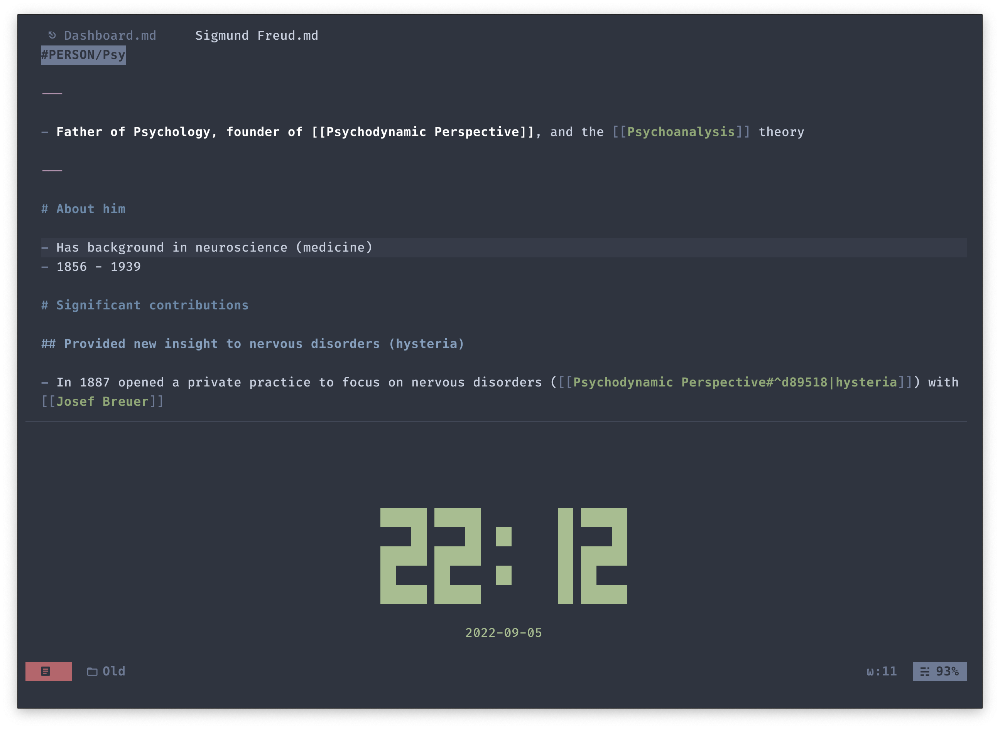
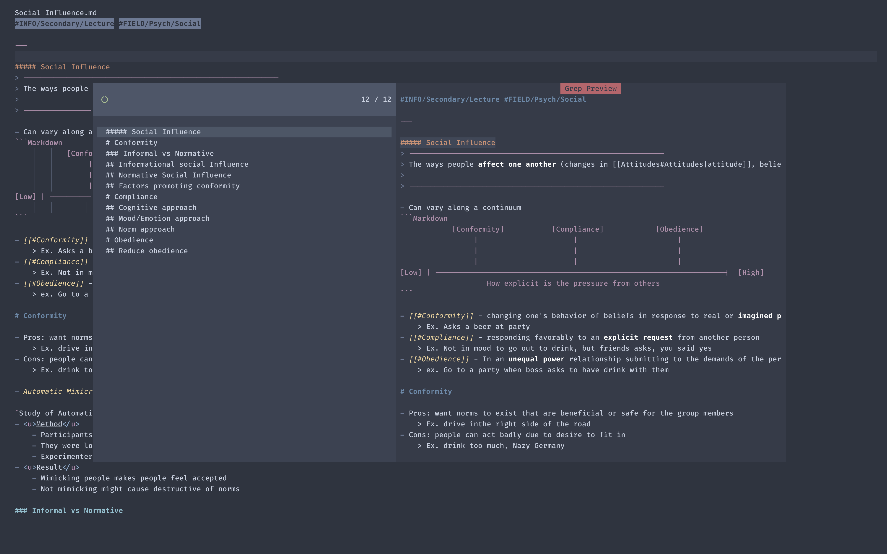

<h1 align="center"> &#9961 nvim &#9961 </h1>

> Disclaimer: this set up is my personal set up, mostly for the purpose of note taking (in markdown) and writing (in latex). I use this along [obsidian](https://obsidian.md/) as my personal note taking tool.

A nvim configuration template with nord colorscheme, written in `lua`, designed for note taking.

Click to See More Showcases

    
    
    

# Key Features

- Contrasting while still Nordic colorscheme!
    - My personal fork for the [onenord.nvim](https://github.com/rmehri01/onenord.nvim) theme, some adjustment are inspired by [nightfox.nvim](https://github.com/EdenEast/nightfox.nvim).
- Zettelkasten note taking tool with [telekasten.nvim](https://github.com/renerocksai/telekasten.nvim)
    - I used my personal fork for UI and some small adjustment, a little out dated with main's functionality
- Lazy loading (Under 50 msec startup time).

## Plugins

- Syntax highlighting with [nvim-treesitter](https://github.com/nvim-treesitter/nvim-treesitter).
- Keymap reminder with [which-key.nvim](https://github.com/folke/which-key.nvim).
- Pretty icons with [nvim-web-devicons](https://github.com/kyazdani42/nvim-web-devicons).
- Easy looking indentlines with [indent-blankline.nvim](https://github.com/lukas-reineke/indent-blankline.nvim).
- Startup screen with [dashboard-nvim](https://github.com/glepnir/dashboard-nvim).
- File tree with [nvim-tree.lua](https://github.com/kyazdani42/nvim-tree.lua).
- File finder, previewing files with [telescope.nvim](https://github.com/nvim-telescope/telescope.nvim).
- Minimal but nice statusline with [lualine.nvim](https://github.com/nvim-lualine/lualine.nvim).
- Tabs and buffers manager with [bufferline.nvim](https://github.com/akinsho/bufferline.nvim).
- Auto pairing braces and tags with [nvim-autopairs](https://github.com/windwp/nvim-autopairs).
- Easy commentor with [Comment.nvim](https://github.com/numToStr/Comment.nvim).
- Improved UI experience with [dressing.nvim](https://github.com/stevearc/dressing.nvim).
- Pre-configed lsp for with [nvim-lspconfig](https://github.com/neovim/nvim-lspconfig) and [nvim-lsp-installer](https://github.com/williamboman/nvim-lsp-installer).
- Autocompletion with [nvim-cmp](https://github.com/hrsh7th/nvim-cmp).
- Modern command line UI with [noice.nvim](https://github.com/folke/noice.nvim)
- Snippets with [ultisnips](https://github.com/SirVer/ultisnips).

## Details

<!-- For video demo of the setup, view this: -->

For more details regarding the configuration and setup, view the wiki page.

# TODO

- Potential migrate to snippets to [LuaSnip](https://github.com/L3MON4D3/LuaSnip) to make fully `lua`
